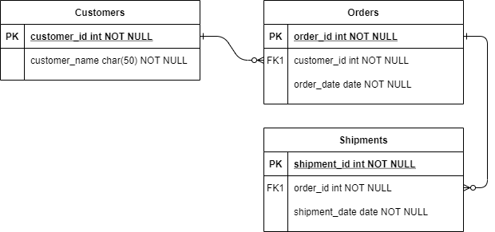

# Virto Commerce Marketing Campaigns Module

## Overview

The Marketing Campaigns module provides a centralized place to manage the lifecycle of marketing promotions. It introduces the **MarketingCampaign** entity that groups one or more promotions and controls their common properties — store scope, active state, and date range — from a single place.

**Key capabilities:**

- Create and manage campaigns with a unique code, localised name and description, store assignment, and active period.
- Attach or detach existing Marketing module promotions to a campaign.
- Automatically propagate `StoreId`, `IsActive`, `StartDate`, and `EndDate` changes from a campaign to all attached promotions.
- Full CRUD and search API for campaigns.

**Dependency:** requires `VirtoCommerce.Marketing` module (≥ 3.1001.0).

## Functional Requirements

| Property | Type | Description |
|---|---|---|
| Code | string | Unique campaign code |
| Name | string | Localised display name |
| Description | string | Localised description |
| StoreId | string | Target store |
| IsActive | bool | Enables/disables the campaign and all attached promotions |
| StartDate | DateTime? | Campaign start date, propagated to promotions |
| EndDate | DateTime? | Campaign end date, propagated to promotions |
| PromotionIds | string[] | IDs of attached Marketing module promotions |

## Scenarios

1. **Create a campaign** — `POST /api/marketing-campaigns` with campaign data.
2. **Search campaigns** — `POST /api/marketing-campaigns/search` with keyword, storeId, isActive filters.
3. **Attach promotions** — `POST /api/marketing-campaigns/{id}/promotions/attach` with a list of promotion IDs. The campaign's current StoreId, IsActive, StartDate and EndDate are immediately applied to the newly attached promotions.
4. **Detach promotions** — `POST /api/marketing-campaigns/{id}/promotions/detach`.
5. **Update campaign properties** — `POST /api/marketing-campaigns`. Changes to StoreId, IsActive, StartDate or EndDate are propagated to all currently attached promotions.
6. **Delete campaigns** — `DELETE /api/marketing-campaigns?ids=...`.

## Web API

| Method | Route | Permission | Description |
|---|---|---|---|
| POST | `/api/marketing-campaigns/search` | `marketing-campaigns:read` | Search campaigns |
| GET | `/api/marketing-campaigns/{id}` | `marketing-campaigns:read` | Get campaign by ID |
| POST | `/api/marketing-campaigns` | `marketing-campaigns:create` | Create or update a campaign |
| DELETE | `/api/marketing-campaigns` | `marketing-campaigns:delete` | Delete campaigns by IDs |
| POST | `/api/marketing-campaigns/{id}/promotions/attach` | `marketing-campaigns:update` | Attach promotions |
| POST | `/api/marketing-campaigns/{id}/promotions/detach` | `marketing-campaigns:update` | Detach promotions |

## Database Model

Two tables are created:

- `MarketingCampaign` — stores the campaign entity.
- `MarketingCampaignPromotion` — join table linking campaigns to promotion IDs (cascade delete).

## Security

Permissions registered under the `MarketingCampaigns` group:

- `marketing-campaigns:access`
- `marketing-campaigns:read`
- `marketing-campaigns:create`
- `marketing-campaigns:update`
- `marketing-campaigns:delete`

## Related topics

- [VirtoCommerce Marketing Module](https://github.com/VirtoCommerce/vc-module-marketing)

## License

Copyright (c) Virto Solutions LTD.  All rights reserved.

Licensed under the Virto Commerce Open Software License (the "License"); you
may not use this file except in compliance with the License. You may
obtain a copy of the License at

<https://virtocommerce.com/open-source-license>

Unless required by applicable law or agreed to in writing, software
distributed under the License is distributed on an "AS IS" BASIS,
WITHOUT WARRANTIES OR CONDITIONS OF ANY KIND, either express or
implied.
